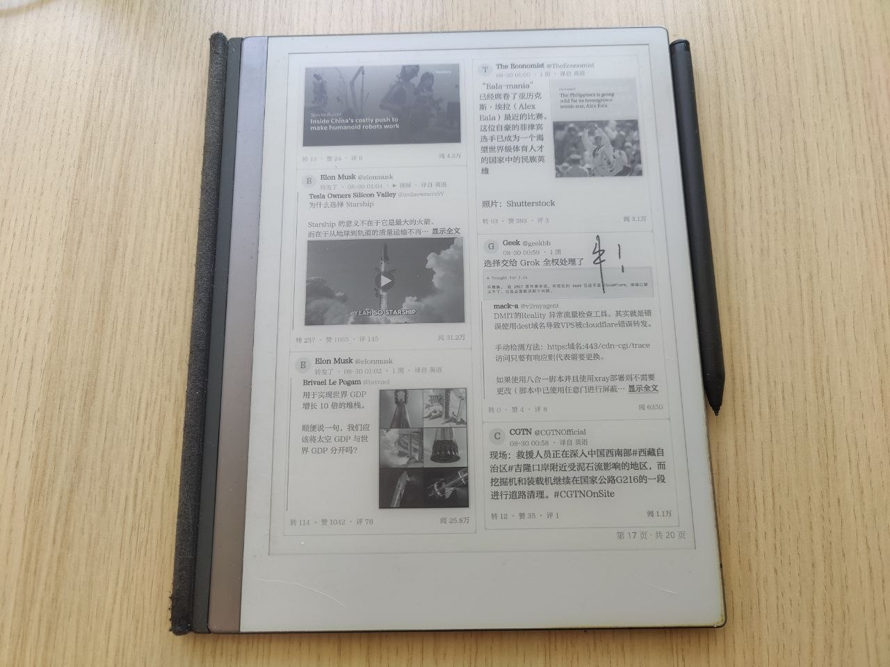

# remarkx — 在 reMarkable 2 上刷 X（Twitter）

> 一台 reMarkable 2 墨水屏上的 X 阅读器：**整页位图阅读**、**手写笔批注即收藏**、
> **一键推送到 Telegram**。设备端直连 X，不依赖家中 PC 中转。

[]()
[]()
[]()



---

## 目录

- [项目简介](#项目简介)
- [背景与动机](#背景与动机)
- [工作原理](#工作原理)
- [功能特性](#功能特性)
- [硬件与环境要求](#硬件与环境要求)
- [快速开始（部署到设备）](#快速开始部署到设备)
- [配置详解](#配置详解)
- [使用指南](#使用指南)
- [从源码构建](#从源码构建)
- [仓库结构](#仓库结构)
- [常见问题](#常见问题)
- [安全说明](#安全说明)
- [免责声明](#免责声明)

---

## 项目简介

`remarkx` 是一套为 **reMarkable 2**（墨水屏电子纸平板）量身定制的 X（Twitter）
阅读方案。它把 X 的关注时间线渲染成**整页位图**，像翻报纸一样在墨水屏上翻页，
并支持直接用电磁笔在页面上**书写批注**。

核心亮点是**"写字即收藏"**：

- 你在某条帖子上用笔写下的任何批注，会按笔迹实际落到的帖子块判定归属——
  每划到一条帖子就单独收藏一条（一页可收藏多条帖子，跨卡/跨栏一笔也能一次收多条）；
- 单独渲染"该帖子 + 你的笔迹"的图片（帖子跨页/跨栏拆分时自动拼合，笔迹保持相对位置）；
- 把这张图和帖子的**完整链接**保存到设备本地；
- 若配置了 Telegram，则**后台自动**把图片推送到你的聊天，说明文字就是帖子链接；
  - 发送全程后台、失败指数退避自动重试、程序崩溃/重启后自动补发；
  - **推送成功即删除本地帖图**，不占设备空间。

> 相比在手机/电脑上刷 X：墨水屏不伤眼、书写批注更接近纸笔体验，非常适合
> 长时间阅读关注时间线。

---

## 背景与动机

reMarkable 2 自带系统（xochitl）只能阅读导入的 PDF/EPUB，无法直接访问网页，
也无法在第三方应用间灵活切换。市面上的墨水屏浏览器要么缺少对 reMarkable 触控
笔事件的支持，要么无法把网页排版成墨水屏友好的版式。

本项目尝试把"刷 X"这件事做得**像读一本书**：

1. **排版**：把推文流排版成 1404×1872 的整页双栏位图，文本为主、图片按槽位
   懒加载，翻页接近翻书；
2. **书写**：原生支持压感笔迹与橡皮擦，笔迹逐页保存、翻页回来自动恢复；
3. **收藏**：不再单独维护一个"收藏夹 UI"，而是把批注当作收藏的入口——你写下的
   每一笔都被捕获为一张带链接的图，可推送到 Telegram 长期留存。

设备完全独立运行：抓取、渲染、推送全部在设备端完成，无需常开 PC。

---

## 工作原理

```
┌────────────────────────────────────────────────────┐
│                    reMarkable 2                     │
│  /home/root/xreader/xr  （Qt6 Quick + epaper QPA）  │
│                                                     │
│   ┌─────────┐   HTTPS(经代理)   ┌───────────────┐   │
│   │ XClient │ ────────────────→ │  X 网页端      │   │
│   │ GraphQL │ ←─────────────── │  GraphQL API   │   │
│   └────┬────┘   Cookie 会话     └───────────────┘   │
│        ▼                                            │
│   ┌─────────┐   流式双栏分页    ┌──────────────┐    │
│   │ Renderer│ ───────────────→ │ 整页位图(QPainter)│ │
│   └────┬────┘                  └──────────────┘    │
│        ▼                                            │
│   ┌─────────┐   手写笔笔迹     ┌──────────────────┐ │
│   │  InkItem│ ───────────────→ │ 写字即收藏：       │ │
│   └────┬────┘                  │ 定位帖子→渲染帖+笔迹│ │
│        │                       │ 图→存 book/ 本地   │ │
│        ▼                       └────────┬─────────┘ │
│   ┌──────────────┐   HTTP POST  ┌────────▼────────┐ │
│   │   Telegram   │ ────────────→│ api.telegram.org│ │
│   │ 后台队列+重试 │              │ (经代理,若配置)   │ │
│   └──────────────┘              └─────────────────┘ │
└────────────────────────────────────────────────────┘
```

关键设计：

- **设备端直连 X**：带 Cookie 的 GraphQL 请求并行拉取 *For You* 与 *Following*
  两条时间线，1:1 交错合并去重；网页端内嵌的 **Grok 译文**优先显示，无译文时显示原文。
- **设备端渲染**：`QPainter` 双栏流式排版整页位图（转推/引用卡片、互动数、绝对时间戳、
  超宽省略号截断），`QQuickImageProvider` 内存出图，翻页零编码。
- **图片懒加载**：先出文字页，图片占位框异步下载后原位贴图；头像到位自动重绘。
- **写字即收藏**：笔迹像素命中当前页的帖子块（一笔可命中多帖）→ 每帖单独
  渲染"帖+笔迹"图 → `renderFavorite` 把该帖在
  整本 feed 里跨页/跨栏的各个拆分块按阅读顺序**重新排成一张单栏单卡**（不再左右
  拼两栏/各自带边框），并**按块精确计算偏移叠加笔迹**——左右两栏写下的笔迹都能
  对应到单卡上的正确内容。
- **Telegram 推送**：待发消息先持久化到 `pending.json`，发送成功才出队；失败按
  10s→20s→40s…（上限 1h）指数退避重试；进程重启后 `flush()` 清退避立即补发；
  成功即 `emit sent()`，设备端删除本地帖图腾空间。

---

## 功能特性

### 阅读体验

- **实时时间线**：打开即抓取，翻到书尾自动续抓更早内容（无后台定时抓取）
- **整页位图**：双栏流式排版，翻页手感接近翻书
- **Grok 译文优先**：有译文显示译文并标注"译自 XX"，无译文显示原文
- **图片懒加载**：文字先行，图片到位原位贴图，失败显示"加载失败"
- **图片全屏**：点按任意图片 → 全屏查看，左右滑在推文多图间切换
- **详情页**：点按任意卡片 → 主帖全文 + 按热度排序的回复（逐页懒加载），点回复可层层钻入
- **分页信息**：右下角实时显示"第 X 页 · 共 Y 页"

### 书写批注

- **压感笔迹**：笔即书写，线宽随压力变化；橡皮擦即擦除
- **逐页保存**：笔迹存 `.draw.png`，翻页自动保存/恢复
- **写字即收藏**：笔迹落到哪个帖子块就收藏哪条（一笔跨多帖则一次收多条），
  渲染"帖+笔迹"图存本地

### 收藏与推送

- 本地保存：帖图 + 完整链接写入 `book/` 与 `favs.json`（不在 UI 展示收藏夹）
- Telegram 推送（可选）：后台队列、指数退避重试、重启补发、成功即删本地帖图
- 说明文字为帖子的完整链接，方便直接点开

### 设备交互

- **手势**：左右滑翻页、顶部下滑退出、底部上滑刷新（边缘手势任何时候可用）
- **启动**：长按顶部中央 ≥2s 进入阅读器（`hello-hotkey` 守护，开机自启）
- **电源**：短按 = 挂起休眠（进度已存），5 分钟无操作自动休眠
- **容错**：无 Cookie/网络失败显示错误页并可重试；触屏 Y 轴自动校正

---

## 硬件与环境要求

| 项目 | 要求 |
| --- | --- |
| 设备 | reMarkable 2（需开启开发者模式 / SSH） |
| 网络 | 设备能访问 `x.com`（通常需要一台家庭代理，如 Clash/V2Ray） |
| X 账号 | 一个已登录 x.com 的账号（建议使用小号），Cookie 需在 PC 浏览器提取 |
| 构建（可选） | reMarkable 官方 SDK（Qt 6.8 sysroot）用于交叉编译 |
| Telegram（可选） | 一个 Bot Token 与目标 chat id（个人聊天/群组/频道均可） |

---

## 快速开始（部署到设备）

在 PC 上运行安装脚本，一次完成：交叉编译 `xr` + `hello-hotkey` → 从浏览器导入
X Cookie → 部署到设备 → 注册开机自启。

```bash
cd remarkx

# 基础部署（会自动从浏览器 brave/chromium 提取 X Cookie）
./deploy/install-remarkable.sh <设备IP> \
    --proxy http://192.168.1.100:7890 \
    --browser brave

# 指定 Cookie 文件
./deploy/install-remarkable.sh <设备IP> \
    --proxy http://192.168.1.100:7890 \
    --cookie-file /path/cookies.json

# 可选：配置 Telegram 收藏推送
./deploy/install-remarkable.sh <设备IP> \
    --proxy http://192.168.1.100:7890 \
    --browser brave \
    --telegram-bot 123456789:AAF... \
    --telegram-chat 987654321       # 或 @频道名

# 可选：帖子时间按指定时区显示（设备常被设成 UTC，会慢 8 小时）
./deploy/install-remarkable.sh <设备IP> \
    --proxy http://192.168.1.100:7890 \
    --browser brave \
    --timezone Asia/Shanghai       # 或 +08:00
```

脚本选项：

| 参数 | 说明 |
| --- | --- |
| `<设备IP>` | reMarkable 的局域网 IP |
| `--proxy` | X 直连用的代理（设备需能访问） |
| `--cookie-file` | 直接提供 X Cookie JSON（`{auth_token, ct0, ...}`） |
| `--browser` | 从 PC 浏览器自动提取（逗号分隔多个，任一成功即可） |
| `--timezone` | 帖子时间显示时区：IANA 名（`Asia/Shanghai`）或偏移（`+08:00`）；缺省用设备本地时区 |
| `--telegram-bot` | Telegram Bot Token（可选，收藏推送） |
| `--telegram-chat` | 目标 chat id / 频道名（可选，与 bot 配套） |

部署内容（`/home/root/xreader/`）：

```
xr                        阅读器可执行文件（QML 已内嵌）
run-reader.sh             阅读器启动/退出脚本
config.json               代理 / Cookie / Telegram 配置
cookies.json              X 登录态 Cookie
fonts/remarkx-cjk.ttf     渲染字体
book/                     收藏帖图 + 笔迹层
favs.json / pending.json  收藏索引 / Telegram 待发队列
```

---

## 配置详解

### `/home/root/xreader/config.json`

```json
{
  "proxy": "http://192.168.1.100:7890",
  "cookies": "/home/root/xreader/cookies.json",
  "timezone": "Asia/Shanghai",
  "telegram_bot": "123456789:AAF...",
  "telegram_chat": "987654321"
}
```

| 字段 | 说明 |
| --- | --- |
| `proxy` | X 直连代理；无协议头时自动补 `http://`，支持 `socks5` |
| `cookies` | X 登录态 Cookie 路径（通常无需修改） |
| `timezone` | 帖子时间显示时区：IANA 名（`Asia/Shanghai`）或偏移（`+08:00`）；缺省用设备本地时区。设备默认设成 UTC，帖子时间会慢 8 小时 |
| `telegram_bot` | Telegram Bot Token（不配置则纯本地收藏） |
| `telegram_chat` | 目标聊天：数字 id（个人/群组 `-100...`）或 `@频道名` |

### Cookie 格式

`cookies.json` 是 `{cookie名: 值}` 的 JSON，至少需要 `auth_token` 与 `ct0`
（另有 `twid`、`guest_id` 更佳）。安装脚本可自动从 Chrome/Firefox 内核浏览器提取。

### 字体

渲染字体为 `xreader-app/fonts/remarkx-cjk.ttf`（方正书宋，GBK 全覆盖）。
**同名覆盖**该文件即可换字体，再运行安装脚本部署。

---

## 使用指南

1. **进入阅读器**：在设备上长按顶部中央约 2 秒（仅手指，笔迹免疫），自动启动阅读器。
2. **翻页**：左右滑动翻页；底部从下往上滑 = 刷新时间线；顶部从上往下滑 = 退出回到原生界面。
3. **看图**：手指点按任意图片 → 全屏查看，左右滑切换多图，点按/下滑关闭。
4. **看详情**：点按任意卡片 → 看主帖全文与按热度排序的回复（回复逐页自动加载）；
   左右滑翻页，底部上滑加载更多，点某条回复钻入它的详情页，顶部下滑返回。
5. **批注收藏**：直接用笔在帖子上书写；离开该页时自动判定归属帖子（一笔划到
   几条帖子就收藏几条，一页可收藏多条）并：
   - 每帖渲染"帖+笔迹"图 + 完整链接存到 `book/`（`favs.json`）；
   - 若配置了 Telegram，后台推送图片（说明 = 帖子链接），成功即删除本地帖图。
6. **休眠**：短按电源键挂起（进度已保存）；5 分钟无操作自动休眠。

---

## 从源码构建

需要在 reMarkable 官方 SDK 环境（Qt 6.8 sysroot）中交叉编译：

```bash
cd xreader-app
cmake -B build -DREMARKX_ASAN=OFF   # 发布版；调试崩溃可改 ON
cmake --build build
```

输出 `build/xr`（ARM 32 位 ELF）。`hello-hotkey` 由安装脚本自动用 SDK 交叉编译
为 armv7l。

> 日常运行请用 `-DREMARKX_ASAN=OFF`（ASan 运行时开销大）；调试崩溃时可用
> `ON` 重编，崩溃信息会写入设备端 `crash.log`。

---

## 仓库结构

```
.
├── xreader-app/          设备端 Qt6 应用源码（抓取 + 渲染 + 阅读器）
│   ├── xclient.*         X 直连客户端：时间线/详情页(TweetDetail)抓取 + 媒体懒加载
│   ├── renderer.*        整页渲染器：双栏排版（含详情页全文排版）、收藏帖图(renderFavorite)
│   ├── pagestore.*       页面状态机：翻页、详情页栈、笔迹、收藏索引、Telegram 联动
│   ├── telegram.*        Telegram 推送：后台队列、指数退避重试、重启补发
│   ├── inkitem.*         笔迹层：压感书写、翻页保存恢复、笔起点定位
│   ├── stylus.*          电磁笔事件/校准
│   ├── powerkey.* / touchguard.*   电源键 / 手掌误触过滤
│   └── Main.qml / Menu.qml         界面（QML 内嵌，单文件可执行）
├── device/launcher/      启动机制：hello-hotkey 长按守护 + 服务单元
├── deploy/               安装脚本 + 浏览器 Cookie 导入工具
└── fonts/remarkx-cjk.ttf 渲染字体（方正书宋）
```

---

## 常见问题

**Q：没有 Cookie / 网络失败？**
进入阅读器会显示错误页并给出原因，点"重试"可重来。Cookie 失效时提示重新导入。

**Q：Telegram 没收到收藏图片？**
先确认部署时带了 `--telegram-bot/--telegram-chat`。发送是**后台队列**：失败会
自动重试，重启设备也会补发，无需手动操作。

**Q：推送成功后本地图片会被删吗？**
会。成功推送到 Telegram 后删除本地帖图（`book/<编号>.png`）并移出 `favs.json`，
只保留很小的笔迹层供翻页恢复。未发送成功或未配置 Telegram 时不会删除。

**Q：为什么收不到 Telegram 图片（HTTP 400）？**
多半是 `--telegram-chat` 配置不对：个人数字 id 需为正数、群组需 `-100...`、
频道需 `@频道名`。

**Q：如何在 PC 上调试渲染？**
`Renderer::renderPage` 可直接用本机 Qt 渲染页面位图到 PNG（配合 fake feed 数据）。

---

## 安全说明

- **X 登录态（Cookie）只存设备本地** `/home/root/xreader/cookies.json`
  （已在 `.gitignore` 排除，不入库），不向任何第三方上传。
- 建议使用**小号** + 浏览器同源 Cookie，行为等同网页浏览。
- `xreader-app/xclient.cpp` 中的 `Bearer` 是 X 网页端公开常量（X.com 前端 JS
  内嵌的公共 token，非账号凭据），无需保密。
- **Telegram Bot Token 属密钥**：只写进设备 `config.json`（已 gitignore）；
  仓库源码不包含任何真实 token / cookie / 代理口令。
- 所有设备端运行数据（`config.json`、`cookies.json`、`pending.json`、`favs.json`、
  `state.json`、`calib.json`、`*.log`）均已加入 `.gitignore`。

---

## 免责声明

本项目通过非官方 GraphQL 接口访问 X 数据，与 X 官方 API 无关；行为等同网页浏览，
仍存在账号被风控的风险。仅供个人学习使用，请自行承担使用后果。
